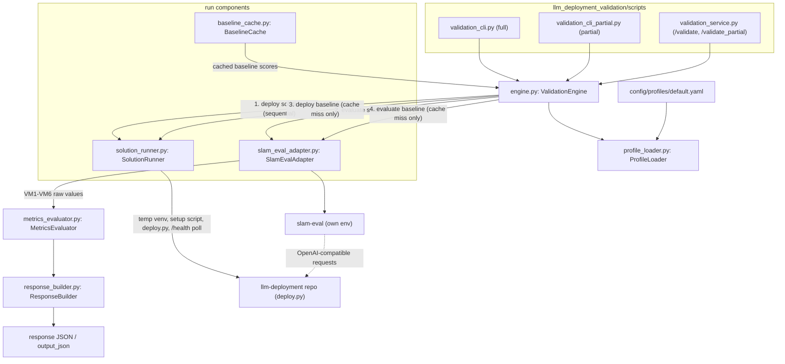

## Validation service (kiss spec)

### 1. Requirement analysis

**R1.** The validation service must be a hydra repo (see the hydra-repo conventions) in this repo implementing the validation spec (section 5): `llm_deployment_validation/scripts/` provides the executable scripts `validation_cli.py` (full validation), `validation_cli_partial.py` (partial validation) and `validation_service.py` (HTTP service with `/validate` and `/validate_partial`), configured via hydra configs in `config/` (including `config/profiles/` for validation profiles), with `llm_deployment_validation/utils/`, `tests/`, `pyproject.toml`, `requirements.txt`, `requirements_dev.txt`, `run_linters.sh` and `README.md` following the same shape as slam-eval. The components (validation engine, profile loader, solution runner, slam-eval adapter, baseline cache, metrics evaluator, response builder) live in `llm_deployment_validation/` and share the interfaces and response JSON defined in validation spec section 5.1.

**R2.** The `default` profile (`config/profiles/default.yaml`) must be the only profile: acceptance criteria AC1, AC2, AC3, AC4 and AC6 in scope with no threshold overrides (the validation spec section 3 defaults apply; AC5 is out of scope in this profile — there is no GPU on this machine, so peak VRAM is not measurable); full validation runs the `merge_quality__merge_quality_easy` collection (100 cases, dataset present at `${dataset_root}/merge_quality/`), partial validation runs the `merge_quality__merge_quality_easy_tiny` collection (3 cases); the validated model-hardware pair of this spec is `Qwen/Qwen3-0.6B` on `huawei-cpu` (this machine).

**R3.** For a validation run, the solution runner must create a temporary Python venv, clone the requested `llm-deployment` repo and check out the requested commit, derive the pair slug from the requested model and hardware identifiers per the pair-slug rule of the solution constitution spec (section 4.3: identifiers joined with an underscore, lowercased, every remaining non-alphanumeric character replaced by an underscore — e.g. `qwen_qwen3_0_6b_huawei_cpu`), run the pair's environment setup script `config/deployment_configurations/<pair slug>.sh` (when it exists, per the solution invocation contract, constitution spec section 3.2) with the temporary venv active, then invoke `python deploy.py model=<model identifier> hardware=<hardware identifier> port=<port> [<solution_overrides>]` in the temporary venv, where `port` is a configurable solution option (overridable via `solution_overrides`) telling the deployment which port to serve on. The solution runner polls `GET /health` on this port until HTTP 200 per the deployment server contract (constitution spec 3.3) and optionally verifies the model via `GET /v1/models`. Deployments are run strictly sequentially (one deployment at a time: first the solution deployment, then the baseline), never in parallel, because an LLM deployment exhausts the machine resources. The temporary venvs and deployment processes are destroyed when the validation run finishes.

**R4.** The slam-eval adapter must run `slam_eval/scripts/main.py` in the validation service's own environment (no separate venv is needed: slam-eval is the measurement tooling of the validation service itself) via its hydra configuration with the `local_llm` model config pointing at the deployed endpoint, the merge_quality collection and scorer selected by the validation scope (R2) and the `local_jsonl` storage adapter with `path_to_jsonl` set to an output file allocated by the adapter inside the validation run's working directory (the file accumulates the per-case predictions of the run). The adapter sends evaluation requests to the HTTP service exposed by the solution deployment and by the baseline deployment (R3), and the output artifacts produced by slam-eval (raw records, aggregated statistics, scores) are the only measurement source. TTFT/TPOT are measured per evaluation request by the slam-eval model layer.

**R5.** The adapter must extract from the slam-eval output artifacts: VM1-VM4 from the aggregated TTFT/TPOT statistics, VM5 from the GPU memory usage samples (not measured by the `default` profile — there is no GPU on this machine — but implemented for the future profiles with GPU hardware), and VM6 as the difference between the solution deployment's and the baseline deployment's quality scores. The baseline deployment is defined in the validation service configs as a specific commit of the solution: a `(repo, commit)` reference stored per validation profile (alongside the model-hardware pair it corresponds to), so the baseline is run exactly like any other solution deployment (R3). Because LLM deployments exhaust machine resources and deployments are run sequentially (R3), the baseline evaluation results must be cached (keyed by the `(repo, commit)` baseline reference, the pair and the validation scope) so that repeated validation runs reuse the cached baseline scores instead of re-running the baseline deployment and evaluation.

**R6.** The metrics evaluator and response builder must produce the response JSON of validation spec 5.1 with the status rules defined there, resolving thresholds through the active profile. Only in-scope criteria (R2) appear in the response.

**R7.** The HTTP service must return HTTP 4xx for malformed requests (missing `repo`/`commit`, wrong types) without starting validation, and HTTP 5xx for unexpected internal failures; CLI scripts must exit non-zero on the same conditions.

**B1.** Invocation variants: `solution_overrides` empty (default) vs non-empty — in the latter the extra `key=value` arguments are appended to the `deploy.py` invocation.

**B2.** Scope variants: full validation (`/validate`, `validation_cli.py`, collection `merge_quality_easy`) vs partial validation (`/validate_partial`, `validation_cli_partial.py`, collection `merge_quality_easy_tiny`).

**B3.** Failure variants: unsupported model-hardware pair or failed startup in `deploy.py` → metrics fail to compute → criterion statuses `invalid`; malformed request → HTTP 4xx and no validation.

### 2. Tests

**T1** (R2). Assert `config/profiles/default.yaml` exists, its acceptance criteria subset is exactly AC1, AC2, AC3, AC4, AC6 with no threshold overrides, its full validation setting references `merge_quality__merge_quality_easy` and its partial validation setting references `merge_quality__merge_quality_easy_tiny`, and its baseline definition contains a `(repo, commit)` reference for the pair `Qwen/Qwen3-0.6B` + `huawei-cpu`. Automated (config validation, no deployments).

**T2** (R6). Feed the metrics evaluator synthetic metric values (with the profile resolved through the profile loader) and assert: statuses accepted / valid / invalid are produced per the validation spec 5.1 rules; out-of-scope criteria (AC5) never appear in the response; thresholds come from the profile. Automated.

**T3** (R1, R7). Run `validation_service.py`, send malformed requests to `/validate` and `/validate_partial`: missing `repo`, missing `commit`, wrong types; assert HTTP 4xx and that no validation started (no deployment processes spawned). Assert `/validate` with a well-formed payload reaches the validation engine (mocked: no real deployment). Automated.

**T4** (R1). Assert the CLI entry points exist, accept the interface of validation spec 5.1 (`repo=`, `commit=`, `output_json=`, `solution_overrides=`, `profile=`), and exit non-zero on malformed arguments; with a mocked engine, assert the response JSON is written to `output_json`. Automated.

**T5** (R3). Unit-test the solution runner against a stub solution repo: assert the pair slug is derived per the slug rule for the requested identifiers, the setup script is run (when present) in the fresh temporary venv, `deploy.py` is invoked with `model=`, `hardware=`, `port=` and appended `solution_overrides` (B1), `GET /health` is polled until readiness, and the venv and process are cleaned up after the run. Automated (stub repo, no real vLLM).

**T6** (R4, R5). Unit-test the slam-eval adapter against fixture artifacts: assert VM1-VM4 are extracted from aggregated TTFT/TPOT statistics, VM6 is computed as the difference of the solution and baseline quality scores, and VM5 extraction is implemented (returns failed_to_compute when no GPU samples exist). Automated.

**T7** (R5). Test the baseline cache: run the (mocked) validation twice for the same request; assert the baseline deployment and evaluation execute only on the first run and the second run reuses the cached baseline scores; assert the cache key includes the `(repo, commit)` baseline reference and the pair. Automated (mocked deployments).

**T8** (B2). Run the same mocked validation through the full path (`validation_cli.py`) and the partial path (`validation_cli_partial.py`); assert the engine receives collection `merge_quality__merge_quality_easy` vs `merge_quality__merge_quality_easy_tiny` respectively and `validation_scope` is `full` vs `partial` in the response. Automated.

**T9** (R1-R6, B2, B3). End-to-end partial validation on this machine: `validation_service.py` with the `default` profile, a well-formed request against the real `llm-deployment` repo; assert the solution deployment starts (health 200), slam-eval runs against it, the response contains AC1-AC4 and AC6 with real computed values and sensible statuses (no `invalid` caused by the service itself). Marked manual: requires model download, vLLM CPU deployment and a slam-eval run; outcome recorded in the implementation summary.

**T10** (R3, B1). End-to-end `solution_overrides` handling: rerun T9 with a non-empty `solution_overrides` (e.g. `max_model_len=8192`); assert the deployment accepts the override and the response is produced. Marked manual; outcome recorded in the implementation summary.

### 3. Implementation plan

#### 3.1 Implementation repos

`llm-deployment-validation`

#### 3.2 High-level design

The design follows the validation spec (section 5.1): the three entry points delegate to the validation engine, which resolves the profile, drives the solution runner and the slam-eval adapter and delegates response assembly to the response builder. The new part of this spec is how the components map onto the hydra-repo layout and how the sequential run (solution deployment → slam-eval evaluation → baseline deployment from the cached `(repo, commit)` reference → slam-eval evaluation → metric extraction and evaluation) is orchestrated:

Key decisions:

- Each component is a module under `llm_deployment_validation/` with a small class or function surface; the scripts are thin hydra-configured wrappers.
- The validation engine enforces strict sequencing: solution deployment → solution evaluation → baseline deployment (skipped on cache hit) → baseline evaluation → evaluation of the criteria. A failure at any deployment step short-circuits the remaining steps and marks the affected metrics `failed_to_compute`.
- The baseline cache is keyed by `(baseline repo, baseline commit, model, hardware, validation scope)`; hits skip both the baseline deployment and its slam-eval run.
- The `port` solution option is passed by the runner; the solution side already supports it in `deploy.py`.

#### 3.3 Todo list

1. [ ] Write the automated tests (T1-T8) in `tests/`
2. [ ] Run all the tests and ensure that they fail
3. [ ] Scaffold the hydra repo: `pyproject.toml`, `requirements.txt`, `requirements_dev.txt`, `run_linters.sh`, `README.md`, package skeleton `llm_deployment_validation/`
4. [ ] Implement the profile loader and `config/profiles/default.yaml` (T1)
5. [ ] Implement the metrics evaluator and response builder (T2)
6. [ ] Implement the validation engine and the three entry-point scripts (T3, T4, T8)
7. [ ] Implement the solution runner (T5)
8. [ ] Implement the slam-eval adapter and the baseline cache (T6, T7)
9. [ ] Run the automated tests until they pass; run the linters
10. [ ] Perform the manual end-to-end runs T9 and T10; record the outcomes in the implementation summary

#### 3.4 Modification summary

| File | Action |
|------|--------|
| `pyproject.toml` | New: package configuration |
| `requirements.txt` | New: runtime dependencies (hydra-core, requests, pyyaml) |
| `requirements_dev.txt` | New: dev dependencies (pytest, linters) |
| `run_linters.sh` | New: linter runner (black, isort, pylint, mypy) |
| `README.md` | New: repo documentation |
| `llm_deployment_validation/__init__.py` | New: package marker |
| `llm_deployment_validation/engine.py` | New: validation engine |
| `llm_deployment_validation/profile_loader.py` | New: profile loader |
| `llm_deployment_validation/solution_runner.py` | New: solution runner |
| `llm_deployment_validation/slam_eval_adapter.py` | New: slam-eval adapter |
| `llm_deployment_validation/baseline_cache.py` | New: baseline cache |
| `llm_deployment_validation/metrics_evaluator.py` | New: metrics evaluator |
| `llm_deployment_validation/response_builder.py` | New: response builder |
| `llm_deployment_validation/scripts/__init__.py` | New: package marker |
| `llm_deployment_validation/scripts/validation_cli.py` | New: full-validation CLI entry point |
| `llm_deployment_validation/scripts/validation_cli_partial.py` | New: partial-validation CLI entry point |
| `llm_deployment_validation/scripts/validation_service.py` | New: HTTP service entry point |
| `llm_deployment_validation/utils/__init__.py` | New: package marker |
| `llm_deployment_validation/utils/common.py` | New: shared helpers (paths, venv tools) |
| `config/config_main.yaml` | New: hydra main config |
| `config/profiles/default.yaml` | New: the `default` validation profile |
| `config/hydra/base.yaml` | New: hydra run-dir setup (following slam-eval) |
| `config/hydra/job_logging/base.yaml` | New: logging config (following slam-eval) |
| `config/user_settings/user_settings.yaml` | New: user-specific settings (venv paths, slam-eval location, cache dir; sourced from environment variables) |
| `tests/__init__.py` | New: package marker |
| `tests/test_profile_loader.py` | New: T1 |
| `tests/test_metrics_evaluator.py` | New: T2 |
| `tests/test_http_service.py` | New: T3 |
| `tests/test_cli_entry_points.py` | New: T4 |
| `tests/test_solution_runner.py` | New: T5 |
| `tests/test_slam_eval_adapter.py` | New: T6 |
| `tests/test_baseline_cache.py` | New: T7 |
| `tests/test_scopes.py` | New: T8 |
