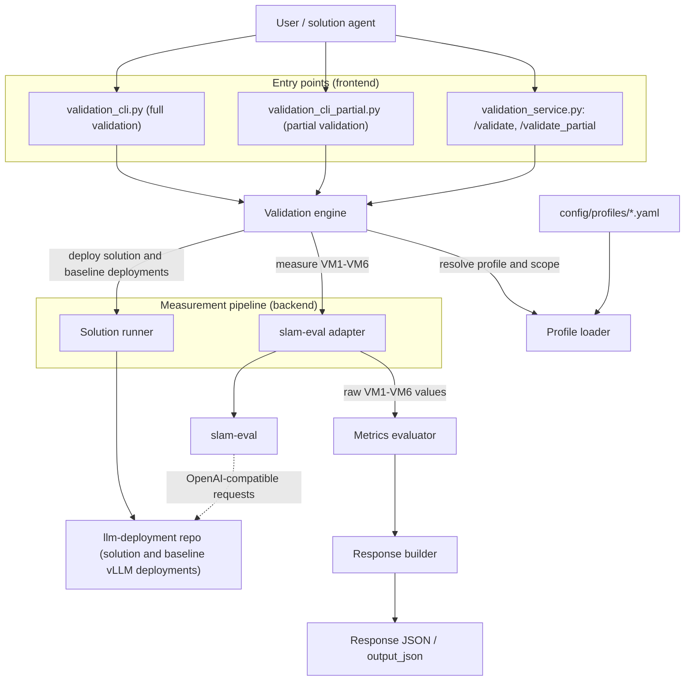
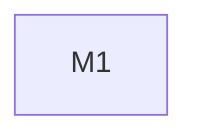

## llm-deployment validation spec

### 1. Repo structure

#### 1.1 Solution subproject management repos

`llm-deployment`

#### 1.2 Validation subproject implementation repos

`llm-deployment-validation`

### 2. Validation metrics

**VM1. Median TTFT (seconds).** The median of the per-request time-to-first-token (TTFT) values measured by slam-eval (part of the slam ecosystem) for the deployment produced by the solution implementation. All measurement details are delegated to slam-eval.

**VM2. Q90 TTFT (seconds).** The 90th percentile of the per-request TTFT values described in VM1, measured by slam-eval. All measurement details are delegated to slam-eval.

**VM3. Median TPOT (seconds).** The median of the per-request time-per-output-token (TPOT) values measured by slam-eval for the deployment produced by the solution implementation. All measurement details are delegated to slam-eval.

**VM4. Q90 TPOT (seconds).** The 90th percentile of the per-request TPOT values described in VM3, measured by slam-eval. All measurement details are delegated to slam-eval.

**VM5. Peak VRAM (GB).** The peak GPU memory usage during the evaluation run, measured by slam-eval for the deployment produced by the solution implementation. All measurement details are delegated to slam-eval.

**VM6. Accuracy loss (percent).** The accuracy loss of the deployed model relative to the baseline deployment strategy (original model precision and no extra-options), computed by slam-eval. All measurement details are delegated to slam-eval.

| FR/NFR | VMs |
|--------|-----|
| FR1 | VM1, VM2, VM3, VM4, VM5, VM6 |

### 3. Acceptance criteria

**AC1. Satisfactory median TTFT.** VM1 < AC1.threshold (default: 2)

**AC2. Satisfactory q90 TTFT.** VM2 < AC2.threshold (default: 5)

**AC3. Satisfactory median TPOT.** VM3 < AC3.threshold (default: 0.05)

**AC4. Satisfactory q90 TPOT.** VM4 < AC4.threshold (default: 0.1)

**AC5. Satisfactory peak VRAM.** VM5 < AC5.threshold (default: 1)

**AC6. Satisfactory accuracy loss.** VM6 < AC6.threshold (default: 1)

| FR/NFR | ACs |
|--------|-----|
| FR1 | AC1, AC2, AC3, AC4, AC5, AC6 |

### 4. Validation profiles

| Profile | Solution subproject | ACs in scope | Threshold overrides |
|---------|---------------------|--------------|---------------------|
| default | `llm-deployment` | all | |

Profiles are stored as config files `config/profiles/<name>.yaml` in the validation service implementation. The validation spec is the source of truth: the config files must mirror this section, and every profile change is a revision of the validation spec.

### 5. Overall validation service design

#### 5.1 High-level design

The following diagram shows the core components of the validation service (each of them is clarified individually in section 5.2) and the external systems they interact with:



The validation service must support validation profiles and two validation scopes: full and partial. The validation profile specifies internally what's understood by full validation and what by partial validation. The response of every validation run must include the profile name. Only full-validation results may certify the "accepted" status; partial-validation results are diagnostic. The validation service provides three ways of performing validation:
1. CLI (full validation)
  - The executable script `validation_cli.py` is run by a user/agent via `python validation_cli.py repo=<clonable link to repo> commit=<commit hash> output_json=<path to output json> solution_overrides="<args separated by whitespaces>" profile=<profile name>` where `repo` and `commit` point at the solution implementation to validate, `output_json` points at the output file where the acceptance results will be saved to (see the json format in the "HTTP service" part), `solution_overrides` points at the arguments to be used to run the solution and `profile` selects the validation profile (default: `default`). This script performs full validation.
2. CLI (partial validation)
  - The executable script `validation_cli_partial.py` has the same interface, but is restricted to partial validation. Its results are diagnostic only. All the details distinguishing full validation from partial validation are defined in the profile.
3. HTTP service
  - The executable script `validation_service.py` is run via `python validation_service.py port=<port> profile=<profile name>` expecting that it will load the specified profile (default: `default`), listen to the specified port and accept HTTP POST requests:
    - endpoint `/validate` (full validation) with a json payload `{"repo": "<clonable link to repo>", "commit": "<commit hash>", "solution_overrides": "<args separated by whitespaces>"}` where `solution_overrides` is optional (default: an empty string);
    - endpoint `/validate_partial` (partial validation) with the same payload format.
    The expected answer is a json
```
{
  "profile": "<profile name>",
  "validation_scope": "<full or partial>",
  "AC1": {
    "status": "<accepted, valid or invalid>",
    "metrics_status": {
      "VM1": {
        "computation_status": "<computed or failed_to_compute>",
        "acceptance_status": "<accepted or rejected>",
        "computed_value": <computed metric value if computation_status == computed and null otherwise>,
        "expected_value_or_threshold": <the resolved threshold value from the acceptance criterion condition, as a bare number, via the active profile>,
        "error_message": "<null if computation_status == computed and the actual error message otherwise>"
      },
      "VM2": ...,
      "VM3": ...
    }
  },
  "AC2": ...,
  "AC3": ...
}
```
    Only the acceptance criteria in scope of the active profile appear in the response — the criteria disabled by the profile are simply not reported.
Here is an explanation of the acceptance criterion status:
- status "accepted" means that all the criterion metrics have acceptance_status "accepted"
- status "valid" means that all the criterion metrics have computation_status "computed" and at least one has acceptance_status "rejected"
- status "invalid" means that at least one criterion metric has computation_status "failed_to_compute"

The part above defines the frontend of the validation service. The backend (measurement pipeline) works as follows. All measurements behind VM1-VM6 are produced by running slam-eval via its main script, configured through its hydra configuration; the validation service never measures latency, memory or accuracy itself. The solution runner deploys both the solution deployment (with `solution_overrides`) and the baseline deployment (original model precision and no extra-options) via the solution's scripts through the same invocation path; both deployments expose OpenAI-compatible endpoints requested by slam-eval. The slam-eval adapter maps the slam-eval output artifacts to the raw VM1-VM6 values passed to the metrics evaluator. Full and partial validation use the same pipeline; they differ only in the slam-eval configuration defined by the profile (e.g., the size of the eval-case collection).

#### 5.2 Core components

The validation service consists of the following core components:

1. **Validation engine.** The orchestrator shared by all the three entry points. For a given request (`repo`, `commit`, `solution_overrides`) it resolves the active validation profile and validation scope, drives the solution runner and the slam-eval adapter, passes the measured metric values to the metrics evaluator and delegates response assembly to the response builder.
2. **Profile loader.** Loads `config/profiles/<name>.yaml` and checks that the profile is well-formed with respect to this spec: it references only the acceptance criteria defined in section 3, every acceptance criterion in scope has a numeric threshold override or the default threshold from section 3 applies, and the profile specifies what full and partial validation mean for it (as required by section 5.1). A malformed profile is an immediate validation error. On success, the loader exposes the resolved configuration to the validation engine.
3. **Solution runner.** Clones the solution repository, checks out the specified commit, applies `solution_overrides` and invokes the solution's scripts as defined by the solution invocation contract in the `llm-deployment` constitution spec (sections 3.2 and 3.3). It also launches the baseline deployment used by VM6.
4. **slam-eval adapter.** The only component interacting with slam-eval: it configures and runs the measurement for the active profile and validation scope against the deployment produced by the solution runner and returns the raw values of VM1-VM6. For VM6, slam-eval produces the quality scores of the solution and baseline deployment evaluation runs, and the adapter computes the accuracy loss as the difference of these scores.
5. **Metrics evaluator.** For every acceptance criterion in scope of the active profile, computes `computation_status`, `acceptance_status` and the criterion status (accepted, valid or invalid) from the measured metric values and the profile-resolved thresholds, following the status rules in section 5.1.
6. **Response builder.** Assembles the response JSON defined in section 5.1 (profile name, validation scope, in-scope acceptance criteria only) and, for CLI runs, writes it to `output_json`.
7. **CLI entry points.** `validation_cli.py` (full validation) and `validation_cli_partial.py` (partial validation) with the interfaces defined in section 5.1; both delegate to the validation engine.
8. **HTTP service.** `validation_service.py` exposing the `/validate` and `/validate_partial` endpoints defined in section 5.1, validating request payloads (HTTP 4xx for malformed requests, HTTP 5xx for unexpected failures) and delegating to the validation engine.

### 6. Roadmap

| ID | Name | Status | Expected result | Duration | Strong scaling efficiency |
|----|------|--------|-----------------|----------|---------------------------|
| M1 | Validation service | To do | A hydra-repo-structured validation service implementing this spec: both CLI entry points and the HTTP service with `/validate` and `/validate_partial`, the validation engine, the profile loader with the `default` profile, the solution runner, the slam-eval adapter, the metrics evaluator and the response builder. Full validation runs end-to-end on real vLLM deployments and produces the response JSON of section 5.1 with real VM1-VM6 values and correct status computation. | 2 | N/A |

There is a single milestone, so there are no dependencies to show.


